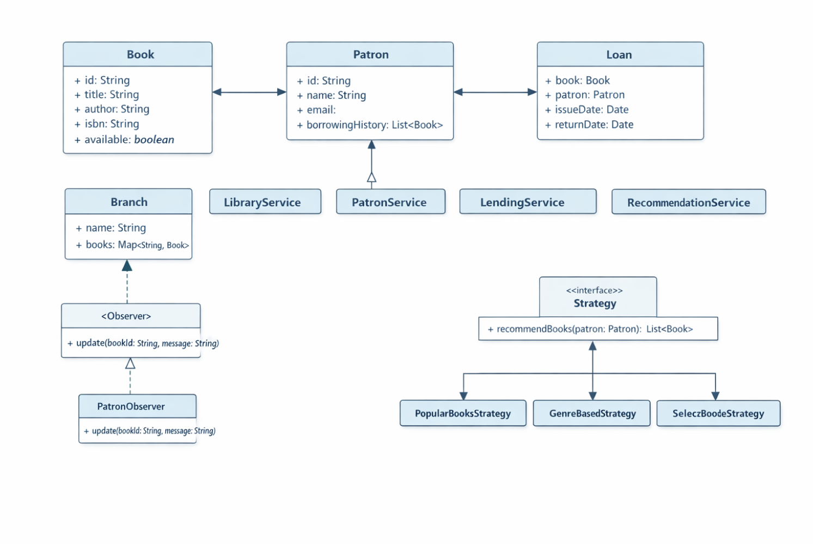

# 📚 Library Management System (Java)

A scalable and modular **Library Management System** built using core Java.  
This project demonstrates strong understanding of **Object-Oriented Programming, SOLID principles, and Design Patterns** in a clean layered architecture.

---

## 📌 Project Overview

This application simulates a multi-branch library system capable of managing:

- Books
- Patrons
- Lending operations
- Reservations
- Recommendations
- Inventory tracking

The system is designed using clean architecture principles and follows best coding practices used in enterprise-level Java applications.

---

## 🎯 Features

### 📖 Book Management
- Add books to library branches
- Remove books
- Search books by:
    - Title
    - Author
    - ISBN
- Track book availability status

### 👤 Patron Management
- Register new patrons
- Update patron details
- Maintain borrowing history

### 🔄 Lending System
- Checkout books
- Return books
- Track active loans
- Prevent checkout if book is unavailable

### 🏢 Multi-Branch Support
- Maintain multiple library branches
- Track inventory per branch
- Transfer books between branches

### 🔔 Reservation System (Observer Pattern)
- Patrons can reserve checked-out books
- Automatically notify next patron when book is returned

### ⭐ Recommendation System (Strategy Pattern)
- Generate book recommendations
- Easily extendable algorithms using Strategy pattern

---

## 🏗 Project Architecture
com.library
│
├── model → Core entities (Book, Patron, Loan, Branch)
├── service → Business logic layer
├── factory → Factory Pattern implementation
├── strategy → Recommendation strategies
├── observer → Observer pattern implementation
├── util → Logger utility
└── Main.java → Application entry point

---

## 🧠 Object-Oriented Concepts Applied

- Encapsulation (private fields + getters/setters)
- Abstraction (Observer, Subject interfaces)
- Polymorphism (Strategy pattern)
- Composition (Branch contains Books, Patron contains borrowing history)

---

## 📐 SOLID Principles Applied

| Principle | Implementation |
|-----------|---------------|
| **S** – Single Responsibility | Each class has one responsibility |
| **O** – Open/Closed | New strategies added without modifying existing code |
| **L** – Liskov Substitution | Strategy implementations are interchangeable |
| **I** – Interface Segregation | Observer & Subject interfaces are minimal |
| **D** – Dependency Inversion | High-level modules depend on abstractions |

---

## 🎨 Design Patterns Used

### 1️⃣ Factory Pattern
Used to create `Book` objects via `BookFactory`.

### 2️⃣ Strategy Pattern
Implemented in `RecommendationService` to support multiple recommendation algorithms.

### 3️⃣ Observer Pattern
Implemented in `ReservationService` to notify patrons when reserved books become available.

---

## 📊 UML Class Diagram

The UML diagram represents:

- Branch → contains → Books
- Patron → borrows → Book
- Loan → connects → Book & Patron
- ReservationService → notifies → Patron

Book
├── id
├── title
├── author
├── isbn
├── publicationYear
└── available

Patron
├── id
├── name
├── email
└── borrowingHistory

Loan
├── Book
├── Patron
├── issueDate
└── returnDate

Branch
├── name
└── Map<String, Book>

LibraryService
PatronService
LendingService
ReservationService
RecommendationService

To view UML:

Open: 

---

## 📦 Technologies Used

- Java 8+
- Java Collections Framework (Map, List, Queue)
- java.util.logging
- Object-Oriented Design
- Design Patterns (Factory, Strategy, Observer)

---

## ▶ How to Run

1. Clone the repository:

2. Open in IDE (IntelliJ IDEA / Eclipse)

3. Run:

Main.java

4. Observe:
    - Console logs
    - Generated `library.log` file

---

## 📝 Logging

The system uses `java.util.logging` with:

- Console logging
- File logging (`library.log`)
- Custom formatting

Logged events include:
- Book additions
- Patron registrations
- Checkouts
- Returns
- Reservations

---

## 👨‍💻 Author

**Chinmay Gaikwad**  

---

Submission Branch for Assignment

